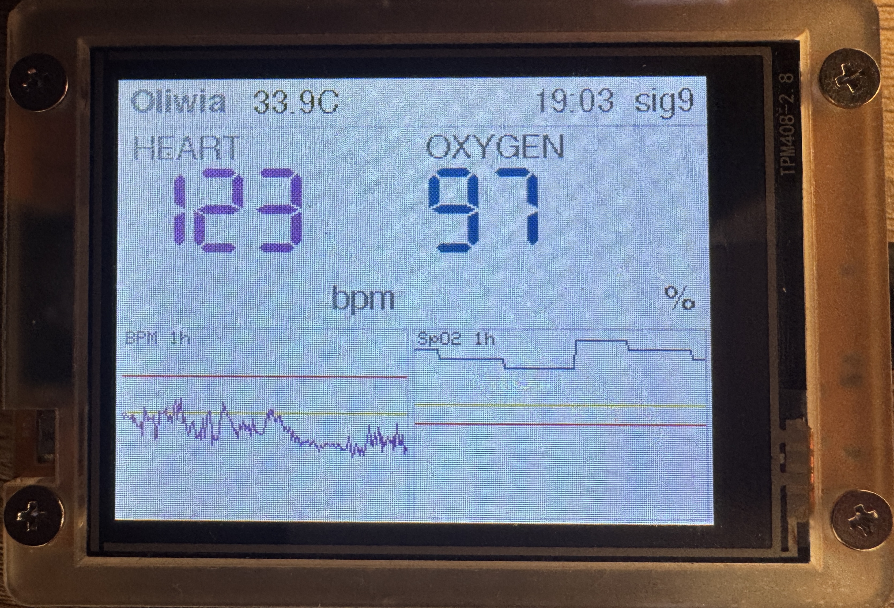
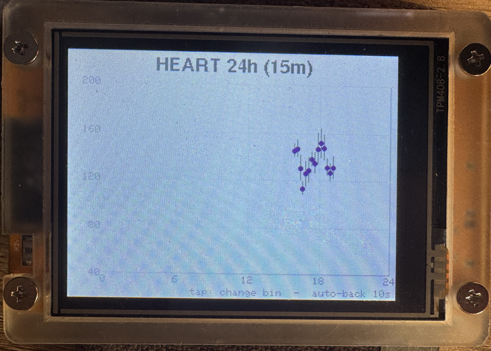
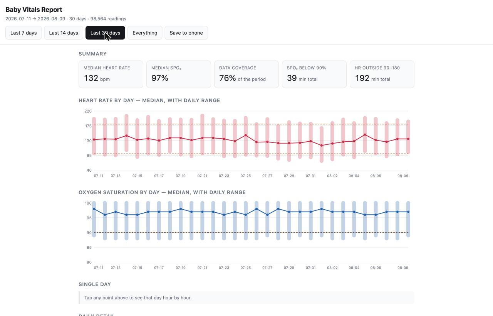
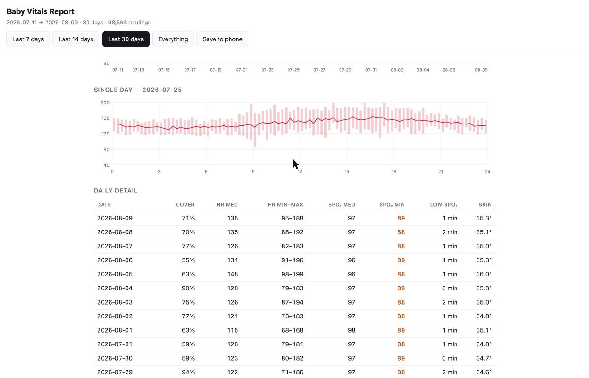

# Baby Sensor Relax — unofficial passive monitor & logger

> **Unofficial, independent project.** Not affiliated with, sponsored by, or endorsed by the
> manufacturer of the Baby Sensor Relax. Not a medical device.

An **unofficial, receive-only** monitor for the *Baby Sensor Relax* wristband. It passively
listens to the Bluetooth Low Energy advertisements the wristband already broadcasts, decodes
the vitals (heart rate, SpO₂, skin temperature), and displays and logs them — **without ever
connecting to the wristband or its base station**, so the official system keeps working
untouched.

Two ways to use it:

- **Standalone device** — an inexpensive ESP32 "Cheap Yellow Display" (CYD) shows the live
  vitals, logs every reading to a microSD card as timestamped CSV, and draws 24-hour touch
  charts. No phone, no cloud, no internet (WiFi is used only to set the clock).
- **On a Mac** — small Swift command-line tools print the live vitals, for reverse-engineering
  or quick checks without any extra hardware.




---

## ⚠️ Important — read this first

- **This is NOT a medical device and NOT a safety monitor.** It is a hobby / educational
  project. Do not rely on it to keep a baby safe. Keep using the official monitor and follow
  your pediatrician's guidance.
- The displayed numbers can be wrong, delayed, or missing (weak signal, poor sensor contact).
- **"Est. Body" is an estimate** (skin temperature + 2 °C), clearly labeled as such — it is not
  a measured core temperature.
- This project is **not affiliated with or endorsed by** the manufacturer of the Baby Sensor
  Relax. Product names are used only to describe compatibility (see *Trademark* below).
- **It is strictly receive-only.** It never transmits to, connects to, pairs with, or modifies
  the wristband or base. It cannot interfere with the official system.

### Legal & reverse engineering

Provided as general context, **not legal advice**:

- **Owned device, passive method.** The protocol was reverse-engineered by passively receiving
  the *unencrypted* BLE advertisements a device **I own** already broadcasts to the room. No
  encryption was decrypted and **no technological protection measure was circumvented**, so
  anti-circumvention laws (e.g. US DMCA §1201) do not apply. Nothing is ever transmitted to the
  wristband or base.
- **Interoperability.** In the EU (where this was built) reverse engineering a lawfully-owned
  product for interoperability is permitted (Software Directive 2009/24/EC; Trade Secrets
  Directive 2016/943), and publishing the resulting interoperability facts is likewise permitted.
- **Trademark.** *Baby Sensor Relax* is a trademark of its respective owner. It is used here
  **only descriptively** (nominative fair use) to state what this project is compatible with.
  This project is **independent and not affiliated with, sponsored by, or endorsed by** the
  manufacturer, and contains **none** of their firmware, code, images, or branding.
- **If you accepted a licence for the official app**, check it for any reverse-engineering clause
  before publishing derivatives.

See [`docs/PROTOCOL.md`](docs/PROTOCOL.md) for the findings.

---

## How it works

The wristband is a **connectionless BLE broadcaster** — it puts the current vitals into the
manufacturer-data field of its advertisement, ~every 1.5 s, in the clear. Anyone in radio range
can read them. The base station is the *intended* receiver (and relays to the cloud), but it is
just one listener among many — a passive sniffer is another, and doesn't affect it.

```
 wristband ──(BLE broadcast, unencrypted)──► base ──(WiFi/cellular)──► cloud ──► phone app
     │
     └──(same broadcast)──► THIS project (passive, receive-only)
```

Decoded fields (all verified against the official app):

| Field | Source byte(s) | Notes |
|-------|----------------|-------|
| Heart rate | `b10` | bpm, updates ~20 s |
| SpO₂ | `b13` | %, commits ~15 min |
| Skin temp | `((b6<<8) \| b7) / 10` | °C, 0.1° res (big-endian uint16); updates ~every 15 min |
| Signal quality | `b4` | rough contact indicator |

Room temperature is measured by the **base**, not the wristband, so it is **not** available
over BLE. Full details in [`docs/PROTOCOL.md`](docs/PROTOCOL.md).

---

## Hardware (standalone device)

- **ESP32-2432S028 "Cheap Yellow Display" (CYD)** — 2.8" 320×240 touchscreen, ~€10.
  - This unit's panel is marked **`TPM408-2.8`** and is an **ILI9342 (320×240 native)** — note
    this differs from the common CYD's ILI9341 (240×320). The firmware is configured for the
    ILI9342; if your board is the ILI9341 type, adjust the panel class/size in `cyd_vitals.ino`.
  - **Panel colour quirk:** this unit is **BGR** (`rgb_order = true`) *and* renders `TFT_YELLOW`/
    `TFT_RED` swapped, so the warning-line colour constants are deliberately crossed in
    `miniPlot()`. If your panel shows wrong colours, that's the first thing to flip.
  - Chip: classic **ESP32-D0WD (BLE 4.2)** — sufficient, because the wristband uses BLE *legacy*
    advertising.
- **microSD card**, **FAT32** formatted (≤32 GB is FAT32 by default), for CSV logging.
- A 2.4 GHz WiFi network (used only at boot to set the real-time clock via NTP).

---

## Build & flash

Uses [`arduino-cli`](https://arduino.github.io/arduino-cli/) and the ESP32 Arduino core.

```bash
# one-time setup
arduino-cli core update-index
arduino-cli core install esp32:esp32@3.3.11
arduino-cli lib install "LovyanGFX@1.2.26"

# native firmware-logic tests
c++ -std=c++17 -Wall -Wextra -Werror tests/firmware_logic_test.cpp -o scratch-workspace/firmware_logic_test
scratch-workspace/firmware_logic_test

# compile + flash the main firmware (adjust the serial port)
PORT=/dev/cu.usbserial-XXXX
arduino-cli compile -b esp32:esp32:esp32:PartitionScheme=huge_app firmware/cyd_vitals
arduino-cli upload  -b esp32:esp32:esp32:PartitionScheme=huge_app,UploadSpeed=115200 -p $PORT firmware/cyd_vitals
```

Notes:
- **`PartitionScheme=huge_app` is required** — WiFi + BLE + graphics don't fit the default app
  partition.
- If flashing fails at high speed, keep `UploadSpeed=115200` (some USB-serial adapters are
  unreliable at 921600).

---

## First-time setup (WiFi & SD)

The firmware keeps three independent credential slots on the SD card:

- **`/wifi.txt`** — primary network;
- **`/wifi_backup.txt`** — first fallback network;
- **`/wifi_backup2.txt`** — second fallback network, such as another phone hotspot.

Each file contains the SSID on line 1 and password on line 2. The networks are used **only** to
sync the clock over Network Time Protocol (NTP) at boot; WiFi is then fully turned off so BLE runs
cleanly.

The SD card is wired to the ESP32, not to your computer, so you can't drop the file on it via a
card reader unless you remove the card. Two options:

1. **Provision from the ESP32** (no card reader needed): flash `firmware/provision_wifi`, open a
   115200-baud serial monitor, choose `primary`, `backup`, or `backup2`, and enter the credentials at its
   prompts. The provisioner transactionally replaces and verifies only the selected slot, tests
   that network for up to 15 seconds, and never embeds or prints the credential values. Repeat it
   to configure the other slots, then flash `cyd_vitals`.
2. **Card reader**: create `/wifi.txt`, `/wifi_backup.txt`, `/wifi_backup2.txt`, or any combination
   directly on the card using the same two-line format.

Enable a fallback phone hotspot before resetting the monitor away from home; boot-time attempts
are intentionally finite and WiFi is never retried while live Bluetooth monitoring is running.

Timezone is set to **Europe/Warsaw** (CET/CEST with DST) in `cyd_vitals.ino` — change the
`setenv("TZ", ...)` / `configTzTime(...)` strings for your region.

**Boot behavior (normal):** on a cold power-up without valid time, the device tries the primary
network for up to 15 seconds and, after connection, NTP for up to 15 seconds. If that slot does not
obtain time, it disconnects and gives `backup`, then `backup2`, the same bounded attempt. Success
causes one intentional **soft reboot** into BLE-only mode. If all three slots fail, monitoring starts without
clock-based CSV logging or night mode; a later reset retries. This avoids WiFi/BLE coexistence,
which severely throttles reception. The worst case before monitoring starts is about 60 seconds
for two slots and about 90 seconds for all three when networks connect slowly or NTP times out.

---

## Using the device

**Live view** — big Heart rate and SpO₂ up top, skin temperature small next to the name, and a
1-hour BPM and SpO₂ sparkline (with yellow/red warning lines) along the bottom; time and signal in
the header. Values turn red past (configurable, non-medical) alert thresholds.

The live header reports what the receiver can actually distinguish:

- **`scan`** — the 30-second scan-start grace period;
- the normal **`sig`** value — wristband packets are arriving;
- **`BAND / RANGE`** — other Bluetooth traffic is arriving, but the wristband is not;
- **`RADIO RETRY`** — all Bluetooth traffic stopped and rate-limited scanner recovery is active.

**24-hour charts** — tap the **HEART** or **OXYGEN** column (number or sparkline) to open a
full-screen 0:00→24:00 plot showing the **average ± standard deviation** per time-bin. Tap the
plot to cycle the bin size **1 h → 30 min → 15 min**; it **auto-returns to the live view after
10 s** of no touch. On boot the firmware reloads the day's CSV so charts survive a power cycle.

**Night mode** — the schedule follows **sunset and sunrise** for the configured location rather than
two fixed clock times, so it tracks the seasons without anyone editing constants twice a year. From
the night edge the backlight **fades over an hour** from full to about a tenth, and mirrors that
fade over the hour after the morning edge. The display also switches to a **dark theme**: background
and the grey chrome (labels, name, clock, separators, chart grid) flip to their inverse, while the
HEART / OXYGEN / temperature colours stay exactly as they are during the day. The theme cannot fade,
so it flips in one step where the evening fade begins.

Pure solar times are wrong at the solstices — at this latitude the sun rises at 04:14 in late June,
and a monitor that jumps to full brightness then is a defect — so the solar result is **clamped**:
dimming never starts before 19:00 or after 21:00, and brightening never starts before 07:00. In
practice sunset drives the evening edge through spring and autumn and the clamp holds it at the
solstices, while sunrise drives the morning edge for roughly the winter half of the year.

Everything tunable lives in `firmware/cyd_vitals/day_night.h`: `SITE_LATITUDE_DEG` /
`SITE_LONGITUDE_DEG` (currently Warsaw), the three clamp constants, `BRIGHT_DAY_LEVEL` /
`BRIGHT_NIGHT_LEVEL`, and `BRIGHT_RAMP_MIN` for the fade length. The palette is the `*_D` colour
constants in `cyd_vitals.ino`; set `FORCE_NIGHT 1` there to check the dark theme without waiting for
sunset. Until the clock is set the display stays in the daytime look. No network is involved — the
solar maths runs on-device from the date and the timezone offset already in effect, so daylight
saving needs no special handling.

### Critical heart-rate alarm

Above the ordinary warning colours there is one alarm that takes the whole screen. It exists for a
**sustained** heart rate outside the safe band in either direction: at or above **200 bpm**, or at
or below **80 bpm**.

**What triggers it.** A reading at or above 200 starts a one-minute confirmation window. Any
reading below 180 during that minute cancels it — the rate came down and nothing happened. At the
end of the minute the alarm fires if the latest reading is at or above **190** *and* either two
readings reached 200, **or** the rate stopped falling. That second path matters: `205, 195, 185` is
a rate coming down and stays quiet, while `205, 185, 195` dipped and came back and does not.

**The slow side is the same machine with the thresholds read the other way up.** A reading at or
below **80** arms it, anything above **100** cancels it, and it fires if the last reading of the
minute is at or below **90** and either two readings reached 80 or the rate stopped climbing back.
One state machine serves both, so there is a single confirmation window, a single latch and a
single snooze to reason about rather than two that can drift apart. Two differences are deliberate:

- **A heart rate of zero is thrown away before it reaches the slow alarm.** An idle or charging
  wristband broadcasts zero every couple of seconds, and zero is *no reading*, not a very slow
  heart. On the fast side this never mattered, because zero is nowhere near 200.
- **The implausible-collapse rule stays on the fast side only.** Its mirror image — a very slow
  rate jumping to a very fast one — has no such justification, and against a wristband that will
  manufacture numbers off bedding it would wake the house for an artifact.

Dismissing silences both sides at once: one hold, one snooze.

Because the minute is counted rather than thrown away, the timer already reads `01:00` when the
alarm appears. If the rate oscillates either side of 200 the window restarts without cancelling, so
confirmation can take longer — the timer counts from the first crossing, so that delay is visible
rather than hidden.

Two things also raise it immediately, without waiting for the window:

- **the signal dies while armed** — silence after a reading at or above 200 is not a drop, and
  silence after one at or below 80 is not a recovery;
- **an implausible collapse**, a step from 170-plus to 60-or-less, which is either the heart-rate
  byte wrapping past 255 or a genuine emergency. The firmware cannot tell those apart and does not
  try: both alarm.

**What it shows.** Current rate, peak, oxygen **with its age**, elapsed time since onset, a
high-resolution trace of the last 10 minutes (widening to 30 and 60 to keep the onset on screen),
and your emergency phone numbers. Dropouts in the trace are drawn as shaded bands rather than a
line across the gap, because a line across four missing minutes reads as a steady rate for four
minutes. Only the border flashes, so the numbers stay readable.

**Clearing it.** Press and hold anywhere for **three seconds**, watching the countdown. It latches
until you do — no reading clears it, no dropout clears it, and it survives a reboot via RTC memory
and `/alerts.csv`. After a dismissal it stays quiet for ten minutes, then returns if the rate is
still high, so it cannot be silenced and forgotten. Swiping up to export is refused while it is up.

**Test it.** Hold the **HEART** cell for three seconds to run a ten-second `TEST` alarm — real
brightness, real flashing, no log entry. **Run it from where you actually sleep, with the lights as
they normally are.** It is the only way to find out whether the alarm reaches you.

**`/contacts.txt`** on the SD card holds the numbers: up to two lines of up to 30 characters,
rendered exactly as written, so numbers sharing a prefix can go on one line:

```
224 432 969 / 931 / 970 / 973
```

The repository ships no default and contains nobody's real numbers — a stranger who builds this
must not get someone else's hospital on their screen. Without the file the alarm still works, just
without numbers.

**`/alerts.csv`** records every episode, append-only so a power cut mid-episode still leaves a
readable file:

```csv
timestamp,event,hr_bpm,spo2_pct,detail
2026-08-10 03:14:22,ONSET,214,94,CONFIRMED_HIGH
2026-08-10 03:19:41,RESOLVED,176,93,
2026-08-10 03:20:58,DISMISS,171,93,dismissed
```

A six-minute episode that resolves on its own at three in the morning leaves a record worth showing
a clinician. Neither this file nor `/contacts.txt` is served by export mode, which whitelists
`/vitals_*.csv` only — pull the card to read them.

Thresholds and timings are the `HR_CRIT` / `HR_SUSTAIN` / `HR_CANCEL` block at the top of
`cyd_vitals.ino`.

> **The alarm is light only.** The board has no speaker and does not use the network, so it reaches
> someone in the same room and nobody through a closed door. Whether it wakes anyone is a question
> about where the board sits, and no firmware setting changes that.
>
> **Silence is not an all-clear.** The wristband loses contact when the baby moves, and a distressed
> baby moves. The board can also brown out, fill its card, or hang. Any of these produce no alarm.
>
> **The rate can read low when it is high.** The heart rate arrives as a single byte and cannot
> express more than 255. The collapse rule above defends against a wrap but cannot rule it out.
>
> **This is not a medical device** and does not decide whether to seek care.

### Power draw

The board runs off 5 V USB and the on-board AMS1117 is a **linear** regulator, so roughly a third of
the input energy becomes heat before anything useful happens. That sets the floor; the two knobs
above it are the radio and the backlight.

| Setting | Why it is where it is |
|---|---|
| `SCAN_INTERVAL_MS 100` / `SCAN_WINDOW_MS 100` | Continuous scan. Not for more data — the ceiling is one new measurement per ~14–20 s however hard we listen — but because this runs from a powerbank, and many powerbanks switch themselves off when the load drops below a minimum threshold. A receiver that never sleeps keeps the draw above that floor. It also buys frame-loss margin; see the measurements below. |
| `BRIGHT_DAY_LEVEL 255` | Full brightness by day. Backlight current tracks the PWM duty closely, so this costs more than the old 140 — deliberate, for the same powerbank reason as the scan duty. |
| `BRIGHT_NIGHT_LEVEL 26` | About a tenth of full: readable across a dark room at a glance without lighting it up. |
| `BRIGHT_RAMP_MIN 60` | The fade spans an hour at both edges. The render loop refreshes the backlight every 30 s, so that is ~120 steps of ~2 PWM levels — below the threshold where a change reads as a flicker. |

**Don't lower `SCAN_WINDOW_MS` without re-measuring.** Reception degrades much faster than the duty
ratio suggests, because rendering and SD writes compete with the radio. Worst gap between decoded
advertisements, measured on this board with the full firmware running, over ~3 minutes each:

| Window / interval | Duty | Adverts per 30 s | Worst gap | Verdict |
|---|---|---|---|---|
| 99 / 100 | 99 % | ~51 | — | the old setting |
| 500 / 1000 | 50 % | ~29 | **2.0 s** | comfortable — shipped |
| 300 / 1000 | 30 % | ~15 | **13.0 s** | too close to `STALE_MS`, drops to `--` |

> Use a stable, regulated 5 V USB supply. The firmware adds no dummy workload for a power bank.
> If a battery supply is required, choose one whose exact output is explicitly
> documented as always-on at low current.
>
> **`/boot.log` on the SD card** records why each restart happened, so you can tell these apart
> without a current meter: `POWERON` records a cold boot or supply interruption but does not identify
> its cause; `BROWNOUT` means the ESP32 supply fell too low; and `PANIC`/`TASK_WDT` indicate a
> firmware failure.

### Getting the data off the board

**Swipe up** on the live view and the board stops scanning, becomes its own Wi-Fi access point and
serves the logged CSVs to a phone. The screen shows everything you need — network name, password
and address — so there is nothing to configure and nothing to remember. **Swipe down** to go back
to monitoring, or just wait: it returns on its own after 10 minutes.

Because the board *is* the network, this works anywhere — a doctor's office, a car, a basement.
No home Wi-Fi, no phone hotspot, no internet, and the SD card never leaves the slot.

| | |
|---|---|
| Network | `BabyVitals` (WPA2, password `babyvitals`) |
| Address | `http://192.168.4.1` |
| Returns to monitoring | swipe down, or automatically after 10 min |

> **Monitoring is paused the whole time the access point is up**, and the screen says so in red.
> Wi-Fi and BLE cannot share this radio without wrecking reception (the same reason the firmware
> reboots after its NTP sync), so export mode stops scanning outright rather than quietly
> degrading it. The swipe has to cross more than half the screen and be clearly vertical, so
> brushing the display while moving the board will not trigger it.

The page itself does the work — the ESP32 only ships bytes, so the charts can be interactive
without costing the board anything. Pick a range (7 / 14 / 30 days or everything) and it shows
median and daily range for heart rate and SpO₂, a tappable day-by-day breakdown, per-day coverage,
and time spent outside the thresholds. **Save to phone** bundles it all into a single self-contained
`.html` file (~275 KB for a month) that opens later with no board and no network — which is the
version to actually show at an appointment.



Tap any day in either chart and it expands hour by hour, with the full table underneath:



> Screenshots use synthetic sample data, not a real baby's readings.

> The report states plainly that this is a home-built receiver rather than a medical device, and
> shows a **coverage** figure for every day. A wrist sensor drops out when the baby moves, so low
> readings are often motion artefacts; coverage is what tells you how much to trust a given day.

Only `/vitals_*.csv` files are ever served. That is a deliberate whitelist rather than a path
lookup, because `/wifi.txt` on the same card holds your **home** Wi-Fi password in plain text and
anyone in the room can join the access point while it is up.

**CSV logs** — one file per day on the SD card, e.g. `/vitals_2026-08-07.csv`:

```csv
timestamp,hr_bpm,spo2_pct,skin_c
2026-08-07 15:59:21,134,96,
2026-08-07 15:59:38,143,96,35.0
```

Pull the card any time to browse the full history on a computer. `tools/analyze.py` gives a
quick per-column summary of a capture/log.

---

## Mac tools (no extra hardware)

Built and run with the system Swift toolchain (macOS, CoreBluetooth):

```bash
swiftc -O mac/vitals_reader.swift -o vitals_reader
./vitals_reader               # live: HR | SpO2 | skin | signal | RSSI

swiftc -O mac/passive_scan.swift -o passive_scan
./passive_scan 60             # 60 s raw advertisement survey (reverse-engineering)
```

Both are strictly receive-only (scan, never connect). Grant the terminal Bluetooth permission
in *System Settings → Privacy & Security → Bluetooth* on first run.

---

## Repository layout

```
firmware/
  cyd_vitals/       main firmware: display + BLE + WiFi/NTP + SD CSV + 24h touch plots
                    critical_alarm.h  alarm state machine (pure, natively tested)
                    trace_window.h    alarm trace windowing and dropout gaps
                    hold_gesture.h    three-second hold with countdown
                    alert_log.h       /alerts.csv rows and boot reconciliation
                    contacts.h        /contacts.txt parsing
                    alarm_render.h    alarm screen drawing
  reader_serial/    minimal ESP32 reader — decoded vitals over serial (no display)
  bandsniff/        reception test — confirms a classic ESP32 can hear the wristband
  provision_wifi/   one-time helper to write /wifi.txt to the SD card
mac/
  vitals_reader.swift       live decoded vitals on macOS
  passive_scan.swift        raw BLE advertisement survey
tools/
  analyze.py        per-byte / per-column analysis of captures & CSV logs
docs/
  PROTOCOL.md       the reverse-engineered BLE protocol
  images/
```

---

## Contributing

**Code and documentation pull requests are paused.** Bug reports, protocol observations from
your own hardware, and build reports are very welcome — open an issue.

Once contributions reopen they will require agreement to the
[Contributor Licence Agreement](CLA.md) and a `Signed-off-by` line on every commit. You keep
your copyright; the agreement exists so the project's licence can still be changed later
without hunting down every past contributor. A DCO sign-off alone would not achieve that.

Please do not send optical geometry, wavelength handling, PPG pipeline design, sensor-fusion
design, schematics, or wearable mechanical design to this repository — that material is
deliberately unpublished. Read [`CONTRIBUTING.md`](CONTRIBUTING.md) before opening anything.

---

## License & trademarks

Code and documentation: [PolyForm Noncommercial 1.0.0](LICENSE). Provided as-is, with no
warranty. Not a medical device.

**Free for parents.** Build it, flash it, change it, share it — for your own family, or for
any other noncommercial purpose. Hospitals, universities, charities and public research or
health organisations are covered explicitly. What the licence does not allow is selling this
software or devices running it, or building it into a paid product or service. If you want to
do that, ask me. See [`NOTICE`](NOTICE) for the details.

This is *source available*, not OSI open source — a deliberate choice, so the work stays
open to the people it was written for without being commercialised out from under them.

*Baby Sensor Relax* and any related names are trademarks of their respective owner and are used
here only for descriptive/compatibility purposes. This project is independent and unofficial.
